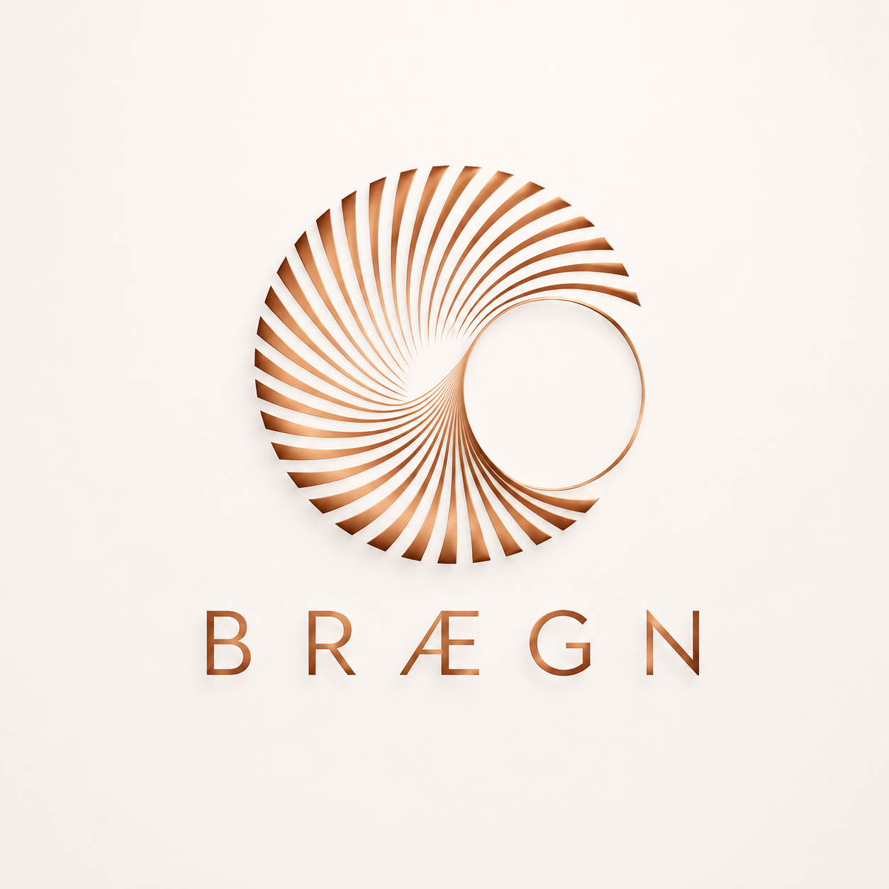

 

 

<table>
<tr>

<td width="42%" align="center" valign="middle">

</td>

<td width="58%" align="left" valign="middle">

              ██████╗ ██████╗  █████╗ ███████╗ ██████╗ ███╗   ██╗
              ██╔══██╗██╔══██╗██╔══██╗██╔════╝██╔════╝ ████╗  ██║
              ██████╔╝██████╔╝███████║█████╗  ██║  ███╗██╔██╗ ██║
              ██╔══██╗██╔══██╗██╔══██║██╔══╝  ██║   ██║██║╚██╗██║
              ██████╔╝██║  ██║██║  ██║███████╗╚██████╔╝██║ ╚████║
              ╚═════╝ ╚═╝  ╚═╝╚═╝  ╚═╝╚══════╝ ╚═════╝ ╚═╝  ╚═══╝

  
<h3>Intelligence Beyond Limits...</h3>

Research • Foundation Models
AI Infrastructure • Software Engineering

<code>RESEARCH</code>
&nbsp;&nbsp;
<code>ENGINEER</code>
&nbsp;&nbsp;
<code>VERIFY</code>
&nbsp;&nbsp;
<code>SHIP</code>

</td>

</tr>
</table>

  

  <!-- Live Profile Views (Komarev) -->
  

  <!-- Live Followers Count (Shields.io) -->
  

<!-- Live Total Stars Count (All Repositories) -->
  

  
# Vision

To build reliable, intelligent, and human-centered AI systems that advance productivity, research, ‎software development, and everyday problem solving through innovative artificial intelligence. 

# About Brægn

Brægn is an artificial intelligence research and engineering organization dedicated to building sovereign AI systems, foundation models, and developer infrastructure.

Our mission is to create intelligent systems that combine deep reasoning, reliable software engineering, and scalable infrastructure to empower developers, researchers, startups, and enterprises.

---

